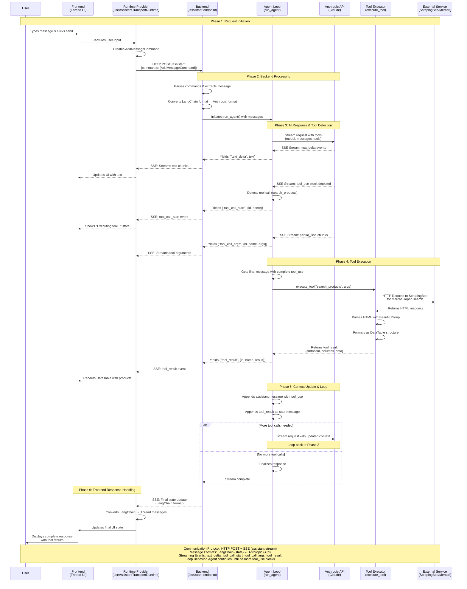

# Tool Call Request Processing - Sequence Diagram

This document provides a high-level UML sequence diagram that visualizes how a tool call request flows through the application, from user input in the frontend to the final response rendering after tool execution.

## Overview

The application is a full-stack AI assistant that enables product search on Mercari Japan. It consists of:
- **Frontend**: Next.js with React, using `@assistant-ui/react` library
- **Backend**: FastAPI with Python, using the Anthropic SDK
- **Communication**: HTTP POST with Server-Sent Events (SSE) streaming via `assistant-stream` protocol

The tool call flow demonstrates an **agentic loop pattern** where the AI can:
1. Receive a user message
2. Decide to call tools (e.g., search_products)
3. Execute the tools and receive results
4. Continue the conversation or make additional tool calls as needed
5. Return the final response to the user

## Sequence Diagram

## Key Phases Explained

### Phase 1: Request Initiation
The user types a message in the chat interface. The Thread UI captures this input, and the Runtime Provider wraps it in an `AddMessageCommand` and sends it via HTTP POST to the backend's `/assistant` endpoint.

### Phase 2: Backend Processing
The backend receives the request, extracts the user message from the command, and converts it from LangChain format (used for state management) to Anthropic format (required by the Claude API). It then initiates the agent loop with `run_agent()`.

### Phase 3: AI Response & Tool Detection
The agent loop sends a streaming request to the Anthropic API with the conversation history and available tools. As the API responds:
- **Text chunks** are streamed back to the frontend for immediate display
- **Tool use blocks** are detected when the AI decides to call a tool (e.g., `search_products`)
- **Tool arguments** are streamed as partial JSON and accumulated

### Phase 4: Tool Execution
Once the complete tool call is received, the backend calls `execute_tool()` which:
1. Makes an HTTP request to ScrapingBee to scrape Mercari Japan
2. Parses the HTML response using BeautifulSoup
3. Formats the data into a DataTable structure
4. Returns the structured result

The tool result is then streamed back to the frontend, which renders it as a DataTable.

### Phase 5: Context Update & Loop
The agent loop appends both the assistant's tool use and the tool result to the conversation context. It then:
- **If more tool calls are needed**: Makes another request to the Anthropic API (creating an agentic loop)
- **If no more tool calls**: Finalizes the response and completes the stream

This agentic loop pattern allows the AI to make multiple tool calls in sequence or even in response to previous tool results.

### Phase 6: Frontend Response Handling
The Runtime Provider receives the SSE stream, converts the state from LangChain format to Thread messages, and updates the UI. The user sees the complete conversation including text responses and tool results rendered as interactive DataTables.

## Key Components

### Backend Files
- **`backend/main.py:175-311`** - `/assistant` endpoint and `run_callback` function
- **`backend/main.py:33-146`** - `run_agent()` function with Anthropic API streaming
- **`backend/tools.py`** - Tool definitions (TOOLS) and `execute_tool()` function
- **`backend/models.py`** - Pydantic models for requests/responses (ChatRequest, AddMessageCommand, etc.)
- **`backend/utils.py`** - Message format converters (LangChain ↔ Anthropic)

### Frontend Files
- **`frontend/app/MyRuntimeProvider.tsx`** - Runtime configuration with `useAssistantTransportRuntime` and state converter
- **`frontend/components/assistant-ui/thread.tsx`** - Main chat UI components (Thread, Composer, Messages)
- **`frontend/app/page.tsx`** - Application entry point

## Technical Details

### Communication Protocol
- **Method**: HTTP POST to `/assistant` endpoint
- **Response**: Server-Sent Events (SSE) using `assistant-stream` library
- **Events**: text_delta, tool_call_start, tool_call_args, tool_result

### Message Formats
- **LangChain Format**: Used for state management in the application
  - `{"type": "human", "content": "..."}`
  - `{"type": "ai", "content": "...", "tool_calls": [...]}`
  - `{"type": "tool", "content": "...", "tool_call_id": "..."}`
- **Anthropic Format**: Used for API communication with Claude
  - `{"role": "user", "content": "..."}`
  - `{"role": "assistant", "content": [{"type": "text", ...}, {"type": "tool_use", ...}]}`
  - `{"role": "user", "content": [{"type": "tool_result", ...}]}`

### Agentic Loop Pattern
The agent loop continues making requests to the Anthropic API until no more `tool_use` blocks are detected in the response. This allows the AI to:
- Use multiple tools in sequence
- Make decisions based on tool results
- Refine its approach dynamically

This pattern is crucial for complex tasks that require multiple steps or data gathering operations.
